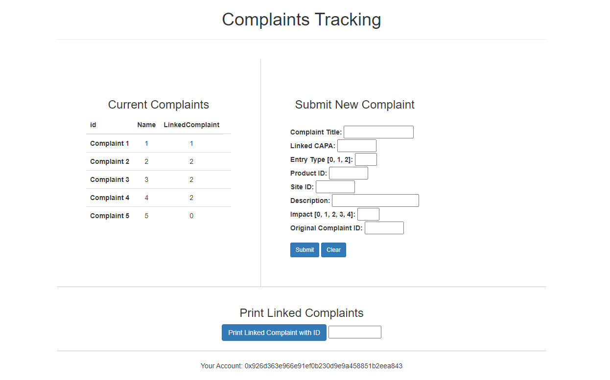
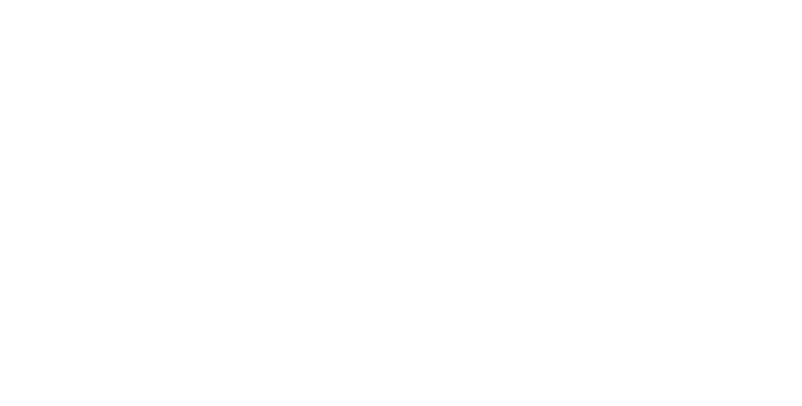

# complaint-tracking-dapp
A proof-of concept DAPP and set of corresponding API interfaces to provide an easy-to-use distributed ledger of complaint handling which serves as a single stream of records that can provide an audit trail. 

## Content

This directory is structured as indicated above. All code needed to clone and run this project, as well as information about system dependencies can be found in the `complaint-tracker` directory. The original project proposal can be found in the `project proposal` directory, and all files related to the final report are located in the `final report` directory.
