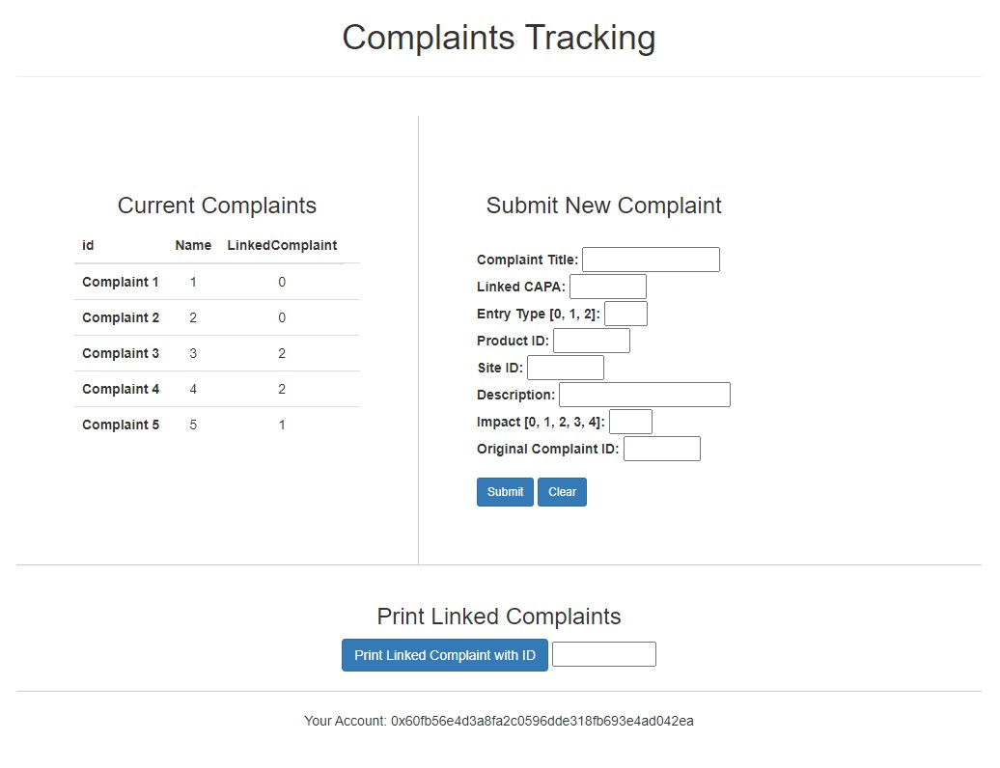
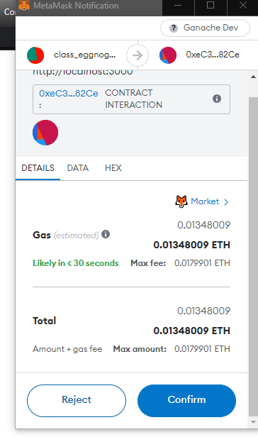
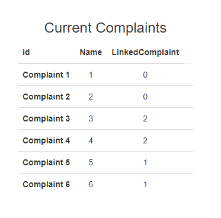

# complaint-tracking-dApp
A proof-of concept dApp and set of corresponding API interfaces to provide an easy-to-use distributed ledger of complaint handling which serves as a single stream of records that can provide an audit trail. 

   

# Repository Content

This directory is structured as indicated above. All code needed to clone and run this project, as well as information about system dependencies can be found in the `complaint-tracker` directory. The original project proposal can be found in the `project-proposal` directory, and all files related to the final report are located in the `final-report` directory.   

# Contract Structure
The contract, named *Complaint*, is made up of a a series of complaint entries and containers and objects to store and keep track of those entries.
  
   

- *complaintEntry* - a custom struct that models the characteristics of the complaints, where each complaint will be its own block in the chain
- *entries* a mapping of arrays of complaintEntries to uint keys to keep track of the complaints
- *entriesIndex* - a mapping of uints to uints to keep track of an entry's position on the block so that it may easily be retrieved
- *entriesCount* - a numeric count of the number of blocks in the chain

Additionall there is a *submitEvent* event object used to trigger refreshes on the application.

## Complaint Entries  
The contract entries are structured as shown above and detailed below. While only the Name, ID, and LinkedComplaint characteristics are relevant for user interaction, the other characteristics have been created to demonstrate the use case for tracking medical complaints.Additionally, some of the "extra" characteristics are used to ensure entries are valid.

- *id* - a unique identifier for the complaint which also matches its block ID on the chain.
- *name* - the user-given name of the complaint.
- *capa* - a numeric identifier to link a complaint to a corrective action plan (capa).
- *entryType* - a numeric enumeration that indicates the type of entry, where 0 = complaint, 1 = addition, 2 = closure.
- *product* - a numeric identifier to map a complaint to a product sku
- *reporter* - the ethereum address used to submit the complaint.
- *site* - a numeric identifier to identify the customer site for the complaint.
- *description* - a short description of the complaint.
- *impact* - a numeric enumeration that indicates the impact of the complaint where 0 = observation, 1 = low, 2 = moderate, 3 = high, 4 = SAFETY.
- *linkedComplaint* - a numeric identifier which can be used to link multiple complaints together, 0 indicates no link.

## Contract Functions  
The contract functions are shown in the image above. They are used to instantiate the contract, populate dummy data, add complaints to the chain, and retrieve information.
- *Complaint()* - this is the constructor which creates the contract, it also populates the contract with five sample complaints without emitting any events that would cause the application to refresh.
- *submitComplaintEntry()* - takes in all parameters of a complaint with the exception of id and reporter to submit a new complaint. The id will be given by the contract and will be the number of the next available block. The reporter address will be the ethereum address associated with the dApp instance that is submitting the complaint.
- *getEntriesCount()* - returns the number of blocks on the chain.
- *getAddingTestData()* - returns the value of the boolean *addingTestData* which is used to prevent refresh-triggering events when populating the contract with test data.
- *getComplaint()* - given a block id (i.e. complaint id) it returns a complaintEntry object.
- *getName()* - given a block id (i.e. complaint id) it returns the name assocaited with that complaint entry.
- *getId()* - given a block id (i.e. complaint id) it returns the id associated with that complaint entry.
- *getLinkedComplaint()* - given a block id (i.e. complaint id) it returns the id of a linked complaint for that complaint entry if it exists.
- *getEntryType()* - given a block id (i.e. complaint id) it returns the entry type of the complaint entry.
  

# Using the dApp

## Connecting Ganache, MetaMask, and dApp
Very complete tutorials have already been created that describe the steps needed to connect the Ganache blockchain, the dApp and its contract, and MetaMask. One of the better ones is by Gregirt McCubbin hosted on dApp University which you can find [here](https://www.dappuniversity.com/articles/the-ultimate-ethereum-dapp-tutorial). Note that you must successfully connect Ganache and the MetaMask extension before you will be able to successfully migrate your contract and launch the dApp.

## Launching the dApp
Once the contract has been built and migrated, the application can be launched. If not already logged into MetaMask, log in and import  on of the example accounts from your Ganache instance using the associated private key. Upon successful launching of the application, you'll see the following.

  

## Your Account
At the bottom of the screen you will see your account address that is currently in use by the MetaMask extension for connection to this application.

## Proof-of-Concept BlockChain Data
This proof-of-concept dApp has been built with five pre-existing block entries on which the functionality can be easily tested.

  

When the dApp is launched, the contract will automatically be populated with these five example complaints.

## Current Complaints
On the left-hand side you can see that the example data populated by the contract creates five blocks, each representing individual complaints. Notice that complaints three and four are linked to complaint two, and complaint five is linked to complaint one.

  

## Print Linked Complaints
When the dApp is launched, you can request the linked complaints be returned as shown below.

  

## Submitting a New Complaint
On the right hand side of the screen is a form to submit a new complaint. If you enter information and hit submit, the contract will check if the entry is valid - i.e. valid entry type, impact type, and linked complaint (if applicable) - before adding it to the chain. If you enter the following dummy data...

  

You'll see that your MetaMask extension will prompt you for a transaction confirmation. Click 'Submit' to allow the transaction to complete.

  

Upon completion the screen will refresh and you'll now see Complaint 6 has been added to the list of current complaints, with block id 6 and linked complaint 1.

   

# Testing the dApp
A test for all functions in the contract is in the test subdirectory of the dApp. It uses both the existing example data as well as some new data. Recall the original example data populates when you run the contract.

  

## Test 1 - Correct Example Data is Generated
The first test deploys the contract and verifies that the contract initializes with five block entries, one for each complaint.

## Test 2 - Correct Parameters for Test Data
This test verifies that each of the 10 parameters for the five example complaints populated as expected on the chain.

## Test 3 - Emit Events Don't Occur Until After Test Data Populates
The test data uses a flag called *addingTestData* to indicate if the addition of test data is occuring, it is initialized to true. If *addingTestData* is true, no emit events that would trigger a refresh of the dApp will occur when a complaint is adding. After all five example complaints are added in the constructor, this flag flips to false. This test verifies that after the test is deployed, the flag toggles to false.

## Test 4 - A New Complaint Can Be Submitted
This test creates a new example complaint, Complaint 6, and verifies it can be added to the chain and emits a refresh-triggering event for the dApp.

## Test 5 - A Valid Entry Type Is Required To Submit A Complaint
Any new complaint submission must have a valid entry type. Recall the mappings are:
- 0 = New Complaint
- 1 = Addendum to Existing
- 2 = Complaint Closure
If a new test submission, Complaint 7, does not have a valid entry type (e.g. entryType = 3), verify that the complaint is not added to the chain.

## Test 6 - A Valid Impact Type Is Required To Submit A Complaint
Any new complaint submission must have a valid impact type. Recall the mappings are:
- 0 = Observation
- 1 = Low
- 2 = Moderate
- 3 = High
- 4 = SAFETY
If a new test submission, Complaint 7, does not have a valid impact type (e.g. impactType = 5), verify that the complaint is not added to the chain.

## Test 7 - A Valid Linked Complaint Is Required to Submit A Complaint
Any new complaint submission must have a valid linked complaint or no linked complaing. The conditions are:
- Linked complaint must exist on the chain
- If no linked complaint set to 0
This test demonstrates that if an invalid linked complaint is passed in a new submission, such as a linked complaint id of 1 + current block length, it is not added to the chain.

## Test 8 - A Complaint Name Can Be Retrieved Given An Index
This test verifies that if passed a valid block index, the corresponding complaint name can be returned.

## Test 9 - A Complaint ID Can Be Retrieved Given An Index
This test verifies that if passed a valid block index, the corresponding complaint ID can be returned.

## Test 10 - A Complaint's Linked Complaint ID Can Be Retrieved Given An Index
This test verifies that if passed a valid block index, the corresponding complaint's linked complaint ID can be returned.

 

# Software BOM
##### [Node Package Manager (NPM)](https://nodejs.org) v18.15.0
##### [Node Version Manager (NVM)](https://npm.github.io/) v0.39.1
##### [Truffle](https://github.com/trufflesuite/truffle) v5.8.2
##### [Ganache](http://truffleframework.com/ganache/) v7.7.7
##### [Solidity](https://soliditylang.org/) v0.8.19 (solc-js)
##### [Web3.js](https://web3js.readthedocs.io/en/v1.8.2/) v1.8.2
##### [MetaMask chrome browser extension](https://chrome.google.com/webstore/detail/metamask/nkbihfbeogaeaoehlefnkodbefgpgknn?hl=en) v10.28.3

 
